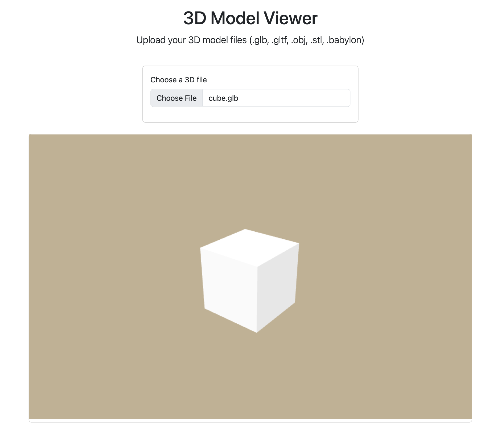
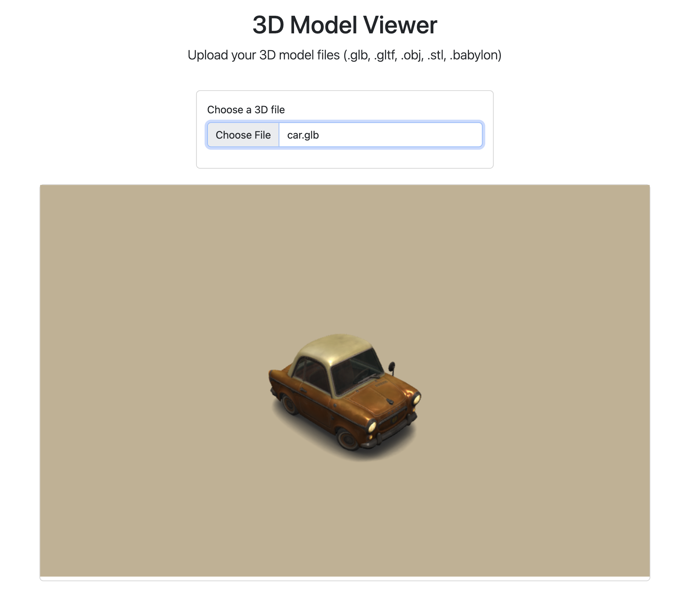
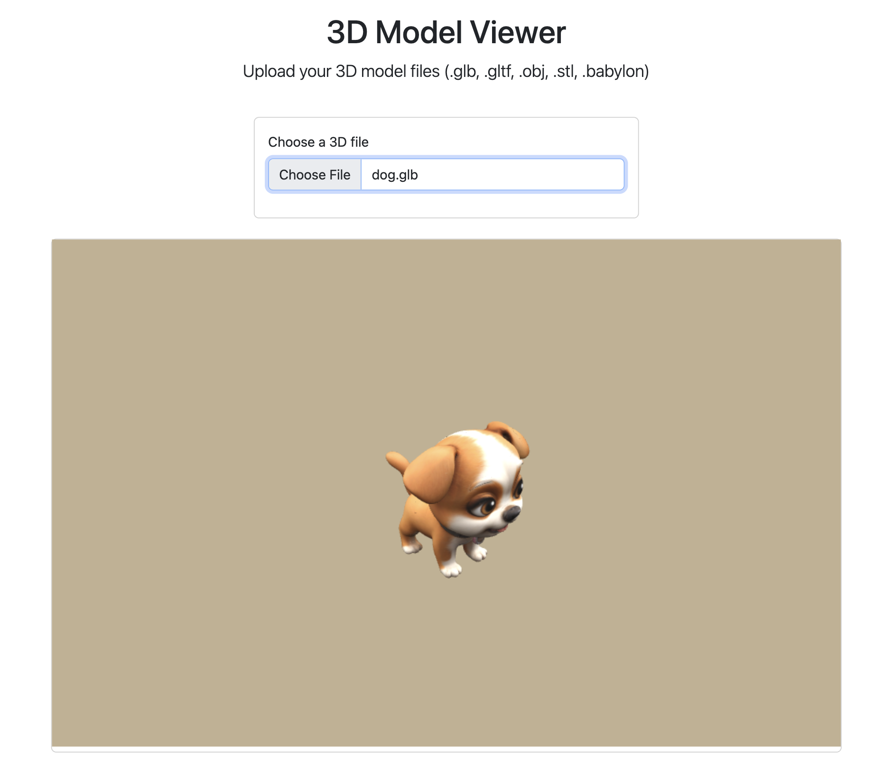

# Flask Lesson App

A simple Flask application to manage lessons. It allows adding, editing, deleting, and viewing lessons through a RESTful API and a basic front-end interface. The lessons are stored in a SQLite database.

## Features

- **RESTful API** to handle CRUD operations for lessons.
- **Unique lesson titles** enforced at both database and API levels.
- **Frontend** built with basic HTML and JavaScript to interact with the API.

## 3D Visualization (Babylon.js)

This application includes an **interactive 3D scene** rendered using Babylon.js. The scene features:

- A **rotatable and zoomable view** using the mouse  
- A **light source** that enhances visibility  
- A **3D cube** that acts as a placeholder model  
- **Smooth animations and real-time rendering**  

### Controls:
- **Left Mouse Click + Drag** → Rotate the view  
- **Scroll Wheel** → Zoom in/out  
- **Right Mouse Click + Drag** → Pan the camera  

### Preview  
Click below to view the 3D model in action:  

<p align="center">
    
    
    
</p>

## Setup

### Prerequisites

- Python 3.x
- pip (Python package installer)

### Installation

1. Clone the repository to your local machine:

    ```bash
    git clone https://github.com/kuock0129/flask-lesson-app.git
    cd flask-lesson-app
    ```

2. Create a virtual environment (optional but recommended):

    ```bash
    python -m venv venv
    ```

3. Activate the virtual environment:

    **Windows:**

    ```bash
    venv\Scripts\activate
    ```

    **Mac/Linux:**

    ```bash
    source venv/bin/activate
    ```

4. Install the dependencies:

    ```bash
    pip install -r requirements.txt
    ```

## Running the Application

1. Start the Flask app for the Lessons App:

    ```bash
    python app.py
    ```

    The application will be running at [http://127.0.0.1:5000/](http://127.0.0.1:5000/). Open the browser to access the front-end interface.

2. Start a simple HTTP server to serve the 3D Model Viewer:

    ```bash
    python -m http.server 8000
    ```

    The viewer will be accessible at [http://localhost:8000/3Dview.html](http://localhost:8000/3Dview.html).

3. To view the **Lessons App** (`index.html`), navigate to:

    ```
    http://127.0.0.1:5000/
    ```

4. To view the **3D Model Viewer** (`3Dview.html`), navigate to:

    ```
    http://localhost:8000/3Dview.html
    ```

## Database Initialization

When running the app for the first time, the database will be initialized automatically with a table for lessons. The database is stored in the `lessons.db` file.

## API Endpoints

### 1. **GET /api/lessons**
**Description:** Get all lessons.

**Response:**

```json
[
  {
    "id": 1,
    "title": "Lesson Title",
    "description": "Lesson Description"
  }
]
```

### 2. **POST /api/lessons**
**Description:** Add a new lesson.

**Request Body:**

```json
{
  "title": "Lesson Title",
  "description": "Lesson Description"
}
```

**Response:**

If successful:

```json
{
  "message": "Lesson added"
}
```

If duplicate title:

```json
{
  "message": "Lesson with this title already exists!"
}
```

### 3. **GET /api/lessons/{lesson_id}**
**Description:** Get a specific lesson by ID.

**Response:**

```json
{
  "id": 1,
  "title": "Lesson Title",
  "description": "Lesson Description"
}
```

### 4. **PUT /api/lessons/{lesson_id}**
**Description:** Update an existing lesson.

**Request Body:**

```json
{
  "title": "Updated Title",
  "description": "Updated Description"
}
```

**Response:**

```json
{
  "message": "Lesson updated"
}
```

### 5. **DELETE /api/lessons/{lesson_id}**
**Description:** Delete a lesson by ID.

**Response:**

```json
{
  "message": "Lesson deleted"
}
```

## Frontend

The frontend allows users to interact with the lessons:

- Add a new lesson via a simple form.
- View all lessons.
- Edit and delete lessons.
- Display a warning if a duplicate lesson title is attempted.

### Files:

- **index.html**: The HTML file containing the frontend interface.
- **3Dview.html**: The HTML file for the Babylon.js 3D Model Viewer.
- **app.py**: The Flask backend logic that handles API requests.

## Technologies Used

- **Backend:** Flask, SQLAlchemy (for SQLite database)
- **Frontend:** HTML, JavaScript, Bootstrap
- **API:** Flask-RESTful
- **Database:** SQLite

## License

This project is licensed under the MIT License - see the [LICENSE](LICENSE) file for details.
